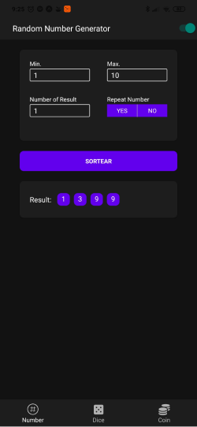
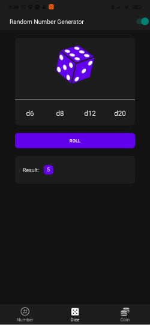
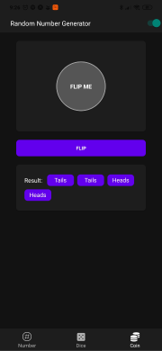
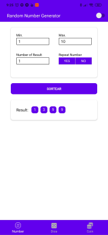
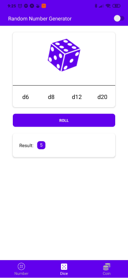

<p align="center">
   
</p>
 
<h1 align="center">Random - Dice | Number | Coin</h1>

<p align="center">	
   <a href="https://www.linkedin.com/in/rafael-goulartb/">
      
   </a>
  

  
  <a href="https://github.com/RafaelGoulartB/RandomNumberApp#readme">
    
  </a>
   <a href="https://github.com/RafaelGoulartB/proffy/commits/master">
      
  </a> 
  
   <a href="https://github.com/RafaelGoulartB/RandomGeneratorApp/stargazers">
      
   </a>
</p>

> O Random app é um Gerador de números aleatorios / Rodador de dados / Cara ou Coroa com tema dark e light feito usando expo SDK 36.

<p align="center">
  <a href="https://play.google.com/store/apps/details?id=com.rafagoulartb.randomapp">
    
  </a>
</p>

<p align="center">
    <a href="README.md">Inglês</a>
    ·
    <a href="README-pt.md">Português</a>
</p>

<div align="center">
  <sub>The ramdom app project. Built with ❤︎ by
    <a href="https://github.com/RafaelGoulartB">Rafael Goulart</a> and
    <a href="https://github.com/RafaelGoulartB/RandomGeneratorApp/graphs/contributors">
      contributors
    </a>
  </sub>
</div>


# :pushpin: Tabela de Conteúdo

* [Tecnologias](#computer-tecnologias)
* [Funcionalidades](#rocket-funcionalidades)
* [Como rodar](#construction_worker-como-rodar)
* [Encontrou um bug? Ou está faltando uma feature?](#bug-problemas)
* [Contribuindo](#tada-contribuindo)
* [Licencia](#closed_book-licencia)

### Dark theme
<div>
  
  
  
</div>

### Light Theme
<div>
  
  
  
</div>

# :computer: Tecnologias
Esse projeto foi feito utilizando as seguintes tecnologias:

* [React Native](https://reactnative.dev/)    
* [Expo](http://expo.io/)     
* [Styled Compoments](https://styled-components.com/)     
* [Eslint](https://eslint.org/)     

# :rocket: Funcionalidades

* Rodador de Dados com 6, 8, 12, 20 lados.
* Gerador de Números Aleatorios.
* Cara ou Coroa.


# :construction_worker: Como rodar
Para rodar o projeto mobile você precisa de um celular com o [expo](https://play.google.com/store/apps/details?id=host.exp.exponent) instlado ou um emulador android/ios.

```bash
# Vá para a pasta mobile
$ cd Proffy/mobile

# Instale as depedencias
$ yarn install

# Rode a aplicação
$ yarn start
```
Depois leia o QRCode com o app do [expo](https://play.google.com/store/apps/details?id=host.exp.exponent) ou rode em um emulador.


# :bug: Problemas

Fique a vontade **para criar uma nova issue** com o respectivo titulo e descrição na página de issues do [Random App](https://github.com/RafaelGoulartB/RandomGeneratorApp/issues) Repositorio. Se você já encontrou a solução para o problema, **Eu amaria fazer o review do seu pull request**!

# :tada: Contribuindo

Confira a página de [contribuição](./CONTRIBUTING.md) para ver como começar uma discução e começar a contribuir.

# :closed_book: Licencia

Lançado em 2020 :closed_book: Licencia

Made with love by [Rafael Goulart](https://github.com/RafaelGoulartB) 🚀.
Esse projeto esta sobre [MIT license](./LICENSE).


Dê uma ⭐️ se esse projeto te ajudou!
